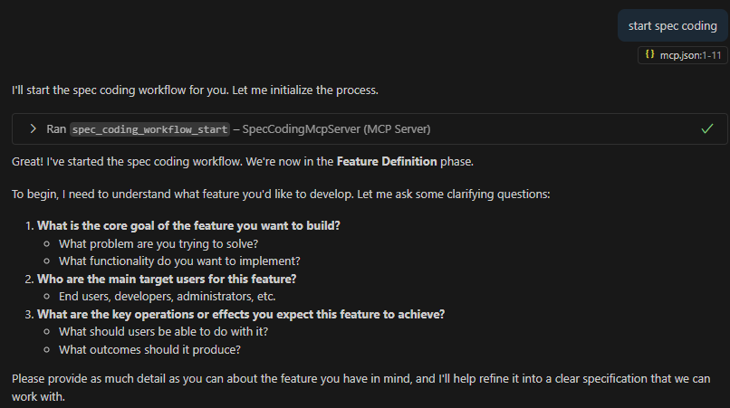
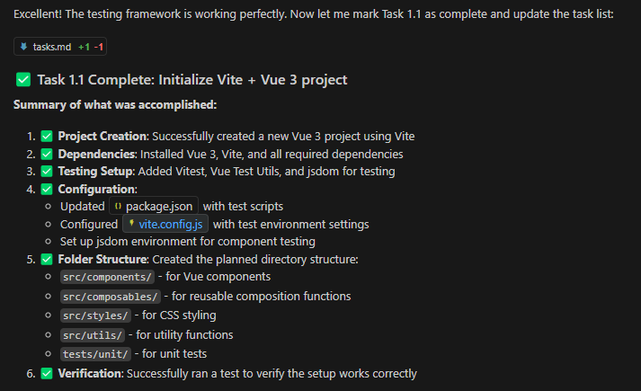

# Spec Coding MCP 服务器

通过系统化的**规格驱动开发**，将功能想法转化为可投入生产的代码

## 什么是规格驱动开发？

**规格驱动开发（Spec-Driven Development）**，简单来说，就是在软件开发过程中，以明确、详细的规格说明作为整个开发流程的核心驱动力。这里的规格说明，涵盖了软件系统的功能需求、性能指标、接口定义、数据格式等各个方面，它就像是建筑施工中的蓝图，为开发者们清晰地描绘出软件最终要达成的样子。

规格驱动开发的核心，是通过标准化的规格文件将模糊需求转化为可执行、可跟踪、可验收的开发流程。本质是把传统软件工程的严谨性融入 AI 编程，让开发从 “凭感觉” 的 “氛围编程”（Vibe Coding）变成 “可把控” 的工程化过程。

规格驱动开发的关键是 “Spec 文件夹”—— 每个功能模块对应一个 Spec 文件夹，包含 3 个核心文件，通过结构化文档将需求、设计、任务 “落地”：
- 1.**requirements.md**（需求文档）—— 用**EARS 语法**（简易需求语法）编写用户故事和验收标准，避免模糊表达。

- 2.**design.md**（技术方案）—— 包含架构设计、流程逻辑、技术选型、潜在风险等细节。

- 3.**tasks.md**（任务清单）—— 将技术方案拆分为**可执行的具体任务**（todolist）

## 使用 spec-coding-mcp 实现规格驱动开发

>`spec-coding-mcp`中的 MCP，即 Model Context Protocol（模型上下文协议），是连接外部工具与 AI IDE 的重要桥梁。只要你的 AI IDE 能够使用 MCP，就可以使用`spec-coding-mcp`。

这里仅以 `GitHub Copilot` 为例，介绍如何使用 `spec-coding-mcp`

###  1. 配置 Vs Code

要让 GitHub Copilot 与 Spec-Coding-MCP 协同工作，需先在相关配置文件中设置 MCP 服务器信息。

访问 NuGet.org，搜索 `SpecCodingMcpServer`，可以看到“MCP Server” 选项卡：

在 Vs Code 的工作区中添加一个 `.vscode/mcp.json` 文件, 将“MCP Server” 选项卡中的 json 复制进去保存。然后点击上面的`start`：

`SpecCodingMcpServer`需要`.NET 10`才能运行，请先确保你的本地安装了 .NET 10(https://dotnet.microsoft.com/en-us/download/dotnet/10.0)

###  2. 启动规格驱动开发流程

- 1.**功能定义**：向 GitHub Copilot 发出 “开始规格编码” 的指令，随后明确具体功能，比如 “创建一个 Vue 待办应用”，并补充相关细节，确认后进入下一步。

- 2.**需求收集**：Copilot 会启动需求收集阶段，生成符合 EARS 格式 的需求文档，确认需求无误后进入设计阶段。

- 3.**设计文档**：基于已确认的需求，Copilot 会生成全面的技术架构设计文档，确认设计没问题后进入任务规划。

- 4.**任务规划**：Copilot 将设计和需求分解为可执行的任务列表，最终会生成包含 requirements.md、design.md 和 tasks.md 的完整 Spec 文件夹结构。

- 5.**任务执行**：确认任务规划后就进入具体的执行阶段。Copilot 会逐一执行任务，直到完成开发。

